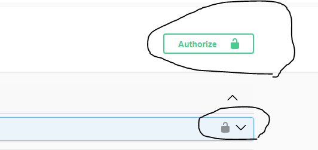
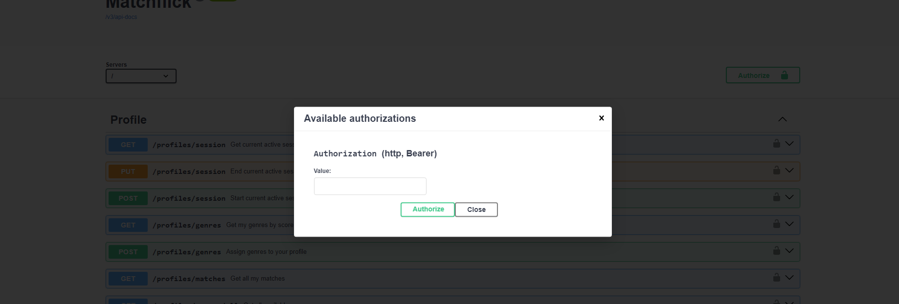
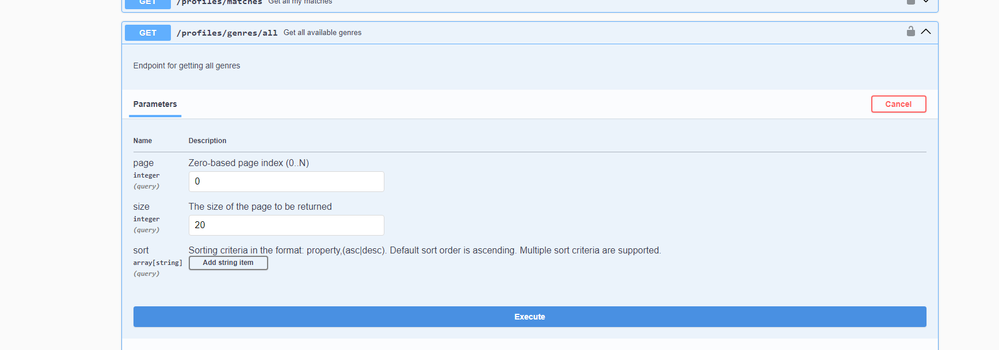

**Matchflick**

🚀 In the folder where `docker-compose.yml` file is located, type and execute `docker-compose up`.
This will automatically start the app.

📘 Swagger documentation is available
at [http://localhost:8080/swagger-ui/index.html](http://localhost:8080/swagger-ui/index.html).

🔐 You need to register first via endpoint `/auth/register`. This endpoint returns an access token
and refresh token.  Click on the endpoint level lock or click on the Swagger
level lock labeled Authorize.  After clicking on either of those, pass the
access token you obtained from the endpoint before. You should be logged in.

🎬 Next, you need to assign yourself some genres. To list genres, click on the
endpoint `/profiles/genres/all`, click on "try it out," and click on
execute.  The response should appear. You can choose your preferred genres by
passing their IDs in the endpoint `POST /profiles/genres` and then hit execute.

🍿 After that, you are ready for your first interaction with the app! The data are loaded from the
startup script and are preloaded for you (these are dummy data and don't contain real value; it's
for showing purposes only).

👥 For the app to fully work, you need a second account. Do the same steps as the first time. When
you are ready, go to the endpoint `POST /profiles/sessions` and enter the username of the second or
first account (depends on which profile you are logged in). After this, the session is started, and
you can see if the session started by executing endpoint `GET /profiles/session`.

🎥 Head down to the Movies section and execute `GET /movies/session`. This will give you either a
completely random movie or one based on your genre preferences. Whether you like the selection or
not, you can copy the ID of a movie and pass it into `POST /movies/session` and specify
with `true/false` if you like the movie or not.

🔍 After this, you can check if there was a match already (which there will not be) by
executing `GET /movies/session/match`. This will either throw a `404 (not found)` or `200` and the
title of a movie.

🔒 For this to happen, you need to log in to the second account you've created (by
executing `POST /auth/login` and passing relevant data). Copy the access token and paste it into the
Auth lock as before.

💞 You can make the selections again from the different profile as before, and when you feel like you
made a match, simply check with the endpoint `GET /movies/session/match`. Every selection affects
the score of the genre on your profile; it either goes up or down, based on that your movie
selection is affected (this needs a little bit of tweaking as I never benchmarked the randomness and
scoring system).

📝 There are some other endpoints as well. You can leave a review on your last matched movie by
executing endpoint `GET /reviews/last`. This will give you a name and an ID, and in the next step,
you can pass the ID in the endpoint `POST /reviews/last` and fill out the rest.

💼 The rest is just simple interaction with your profile, so look around and see it for yourself (
this functionality is not the core of the app and is there to provide some history about your
actions).
